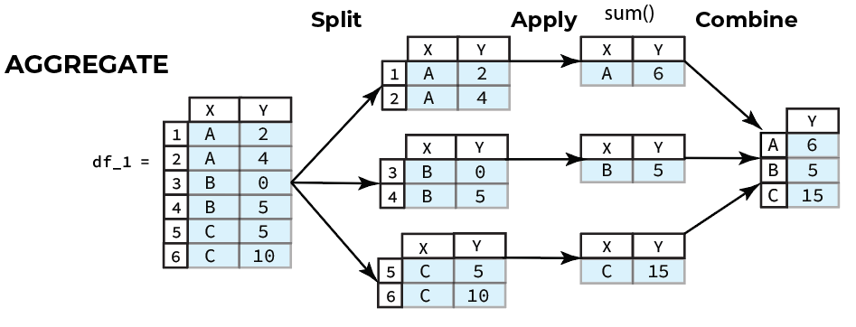
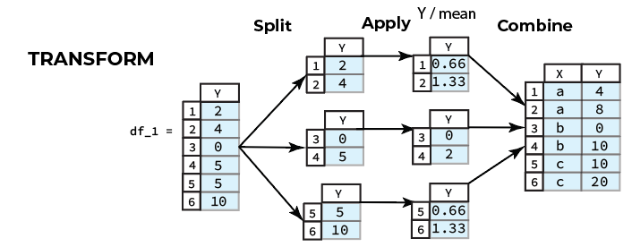
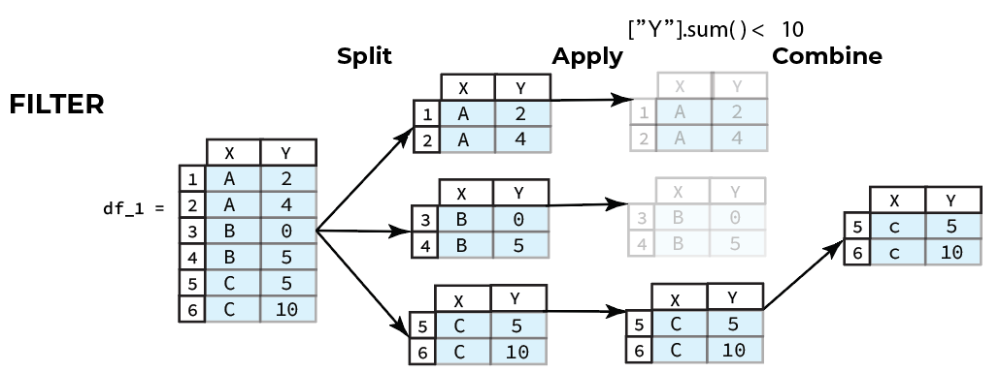

# 6. Advanced Operations on Series and DataFrames

<div class="alert alert-success mt-3" role="alert" markdown="1">
<i class="fa-solid fa-globe fa-xl"></i> **Overview**
<hr/>

**Questions**
* How do you create data chunks using values on one or more columns?
* How do you apply some operation on created data chunks?
* How do you combined the results (processed chunks) into a new `DataFrame` ?

**Objectives**
* Learn how to group data based on a column/s using `groupby`.
* Learn how to process created data groups.
* Learn how to combine the results together.

</div>

## Global Processing Vs. Group Specific Processing

Function application falls into one of two categories:

1. **Global Processing**
2. **Group Specific Processing**

Global processing is applying the same function to every entry (referring to a singular data point or an entire row or column) in a `Series` or `DataFrame`. Group specific processing, on the other hand, is applying functions to entries that belong to a certain group based on some defining characteristic.

We will begin by covering global processing in the following cells.

### Global Processing

In one clever way or another, every global processing problem you will ever run into when working with `DataFrames` will fit into one of two levels of granularity. Corresponding to these two levels are two `DataFrame` methods, `apply()` and `applymap()`.

To apply a function to every row or column of a `DataFrame` we use the `apply()` DataFrame method. The `apply()` method takes a function that will be applied to the specified axis (columns or rows), the axis, and other keyword arguments that are defined by default. Depending on the function passed to the `apply()` can behave in the same way as the `applymap()` function.

#### Global Processing-apply()
Let us look at two examples use cases, using a reducing function, and a universal function. The function passed to the `apply()` method will process a `Series`, either a `DataFrame` row or column depending on the axis parameter, and return a result. 

Most of the time when you call the `apply()` method you should be using a reducing function. A reducing function is one which takes a `Series` object and reduces the `Series` to a either a new `Series` or a single entry using a process that relies on data in the `Series`. You are already familiar with some reducing functions such as the Series `sum()` method, which returns the sum of all the entries in the calling `Series`. Consider the following example of calling `apply()` with a reducing function.

<div class="alert alert-secondary" role="alert" markdown="1">
Code:
```python
df = pd.DataFrame([[ 0,  3,  6], [ 9, 12, 15], [18, 21, 24]], columns=['a', 'b', 'c'])
def square_sum(x_series):
   return x_series.sum() ** 2
df.apply(square_sum, axis=1) # apply to each row
```

Output:
```python
0      81
1    1296
2    3969
dtype: int64
```
</div>

The reducing function, `square_sum()` in the example above sums all the entries in the `Series` and the squares the result. You can define custom reducing functions just like we showed above to to achieve your desired analysis.

A universal function will return a new `Series` that was created by universally applying the same procedure to each `Series` entry. A universal function can be defined using the `Series` `map()` method. The `map()` method will take a function as an argument which will process each individual `Series` entry according to the function definition. For instance refer to the following code example.

<div class="alert alert-secondary" role="alert" markdown="1">
Code:
```python
df = pd.DataFrame([[ 0,  3,  6], [ 9, 12, 15], [18, 21, 24]], columns=['a', 'b', 'c'])
def divide_by_three(x_series):
   return x_series.map(lambda x: x / 3)
df.apply(divide_by_three, axis=0) # apply to each column
```

Output:
```python
     a    b    c
0  0.0  1.0  2.0
1  3.0  4.0  5.0
2  6.0  7.0  8.0
```
</div>

The example above shows how the `apply()` method behaves when a universal function is passed as the argument. The resulting `DataFrame` is constructed from original `DataFrame` except each individual entry is divided by three.

#### Global Processing-applymap()
There is a shorthand way achieve the same exact behavior shown in the example of applying a universal function in the **Global Processing-apply()** cell above, and the method is appropriately named `applymap()`, as first we call the `apply()` DataFrame method and then we call the `map()` method. 

To apply a function to every individual element in a `DataFrame` we can use the `applymap()` DataFrame method.  The `applymap()` method is a function which takes one positional argument as input and that is a callable function which takes a single value and returns a single value. The `applymap()` method will apply the function passed to every single entry in the calling `DataFrame` and return a new `DataFrame` with the processed entries.

Let us see a simple example. We will construct a DataFrame `df` that is 3x3, i.e. there are three rows and three columns. The entries will be consecutive multiples of 3. To each entry we will apply the anonymous function: `lambda x: x / 3` which will divide a given input by 3. The result will be a new 3x3 `DataFrame` with the same index and columns as the caller with entries that are the results of the passed function.

<div class="alert alert-secondary" role="alert" markdown="1">

Code:
```python
df = pd.DataFrame([[ 0,  3,  6], [ 9, 12, 15], [18, 21, 24]], columns=['a', 'b', 'c'])
df.applymap(lambda x: x / 3)
```

Output:
```python
     a    b    c
0  0.0  1.0  2.0
1  3.0  4.0  5.0
2  6.0  7.0  8.0
```
</div>

This type of processing is relatively rare since it should be the case that it makes sense to apply the same function to every entry regardless of its location. But when you need this functionality, the `applymap()` function is quite useful. 

### Group Specific Processing

A common scenario is applying a function to a specific group of data. By group of data I mean a subset of the data that is the same based on a criterion. 

The `groupby()` DataFrame method is used to group rows of data by one or more of the column entries . The `groupby()` method accepts the parameter `by` which specifies how you want to group the rows of the calling `DataFrame`. The creation of groups `by` can be a single column label, a list of column lables, or a callable function. The method will return a `pandas` `GroupBy` object, an object we have not seen before. This object has certain attributes and methods that will be useful to us. In this chapter we will only cover the case of setting the `by` parameter of the `groupby()` method to a single column entry, if you are interested you can read more about the method [here](https://pandas.pydata.org/pandas-docs/stable/generated/pandas.DataFrame.groupby.html). 

If `by` is a sinlge label then the calling `DataFrame` will be grouped by the values in the column with the passed label, i.e. every entry with the same value in the specified column will be in the same group. 

For example, consider the following `DataFrame`:
<div class="alert alert-secondary" role="alert" markdown="1">
Code:
```python
df = pd.DataFrame([[ 'A', 2], ['A', 4], ['B', 0], ['B', 5], ['C', 5], ['C', 10]], columns=['X', 'Y'])
df
```

Output:
```python
   X   Y
0  A   2
1  A   4
2  B   0
3  B   5
4  C   5
5  C  10
```
</div>

For example, let us group the above `df` DataFrame by the values in the `X` column and save the returned GroupBy object to the variable we will call `df_grouped_by_X`. To do this we use the following code.

For example, consider the following `DataFrame`:
<div class="alert alert-secondary" role="alert" markdown="1">
Code:
```python
df_grouped_by_X = df.groupby('X')
```
</div>

`GroupBy` objects have a handy method called `get_group()`, which returns all the entries of a specified group as a `DataFrame`. The `get_group()` method will take a positional argument that is the name of the group to access. Then the method returns a `DataFrame`, which is a subset of the initial `DataFrame` used to instantiate the `GroupBy` object. The entries of the returned `DataFrame` are all those entries in the column specified by the `by` parameter in the original `groupby()` call that match the name used in the `get_group()` call.

Continuing with the example of the `df_grouped_by_X` object, let us see how we would retrieve the group of rows from the `df` whos entries in the `df` column were all the same value of 'A'. This group will conviently have the name 'A', thus when we use the `get_group` method we will simply pass the value 'A'.

<div class="alert alert-secondary" role="alert" markdown="1">
Code:
```python
df.get_group('A')
```

Output:
```python
   X  Y
0  A  2
1  A  4
```
</div>

The same is valid for 'B' and 'C'.
<div class="alert alert-secondary" role="alert" markdown="1">
Code:
```python
df.get_group('B')
```

Output:
```python
   X  Y
2  B  0
3  B  5
```
</div>
<div class="alert alert-secondary" role="alert" markdown="1">
Code:
```python
df.get_group('C')
```

Output:
```python
   X   Y
4  C   5
5  C  10
```
</div>

#### Split Apply Combine
Getting groups can be easily implemented using subsetting. For instance, we could have obtained the "A" group of the `df` DataFrame by subsetting `df` with the boolean `Series` returned from the following operation.

<div class="alert alert-secondary" role="alert" markdown="1">
Code:
```python
df[df.loc[:, "X"]=="A"]
```

Output:
```python
   X  Y
0  A  2
1  A  4
```
</div>

We see in the above example that the returned `DataFrame` is exactly the same as the result we saw in the previous cell introducing `groupby()` and `get_group()`. So why use `GroupBy` objects anyway?

An ideal usage of `groupby()`, and the resulting `GroupBy object`, will apply operations to **each** group independently. Furthermore, `GroupBy` objects are intended to be applied in the context of the data processing paradigm called 
"split-apply-combine"

* **Split** the data into chunks defined using one or more columns.
* **Apply** some operation on the chunks generated. 
* **Combine** the results of the applied operation into a new `DataFrame`.

For instance, suppose we wanted to compute the the sum by `X` and save the result to a news `DataFrame`, the steps we would need to take are:

   1. Split the data by `X`, i.e. `groupby('X')`
   2. Apply the `sum()` method to the `Y` column for each group
   3. Combine the results from each group into a new `DataFrame`


So rather than manually subsetting each group and then applying the desired operation we could automate this workflow using the helpful `GroupBy` methods implemented by `pandas` to save ourselves some time and effort.

##### The 3 Classes of Opearations on Groups

There are 3 classes of split-apply-combine operations that can be applied to group data.

1. __Aggregations__ generate a single value for each group
  
2.  __Transformations__ convert the data and generate a group of the same size as the original group.

3.  __Filters__ retain or discard a group based on group-specific boolean computations.






<div class="alert alert-success mt-3" role="alert" markdown="1">
<i class="fa-solid fa-globe fa-xl"></i> **Key Points**
<hr/>
**Function Application and Mapping**

* **Global Processing**
  * To apply a function to every row or column in a `DataFrame` we can use the `apply()` method
  * To apply a function to every element in a `Series` we can use the `map()` method
  * To apply a function to every element in a `DataFrame` we can use the `applymap()` method
  
* **Group Specific Processing**

  * The `groupby()` method is used to group the data using values on one or more columns

  * `groupby()` is often applied in the context of the data processing paradigm called "split-apply-combine"
    * **Split**: you need to split the data into chunks defined using one or more columns
    * **Apply**: apply some operation on the chunks generated. 
    * **Combine**: combine the results of the applied operation into a new `DataFrame`

  * There are 3 common classes of split-apply-combine operations that can be applied to group data.

    1. __Aggregations__ generate a single value for each group
  
    2.  __Transformations__ convert the data and generate a group of the same size as the original group.

    3.  __Filters__ retain or discard a group based on group-specific boolean computations.
</div>


<div class="alert alert-info" role="alert" markdown="1">
<i class="fa-solid fa-circle-info fa-xl"></i> **For more information**
<hr/>

</div>


